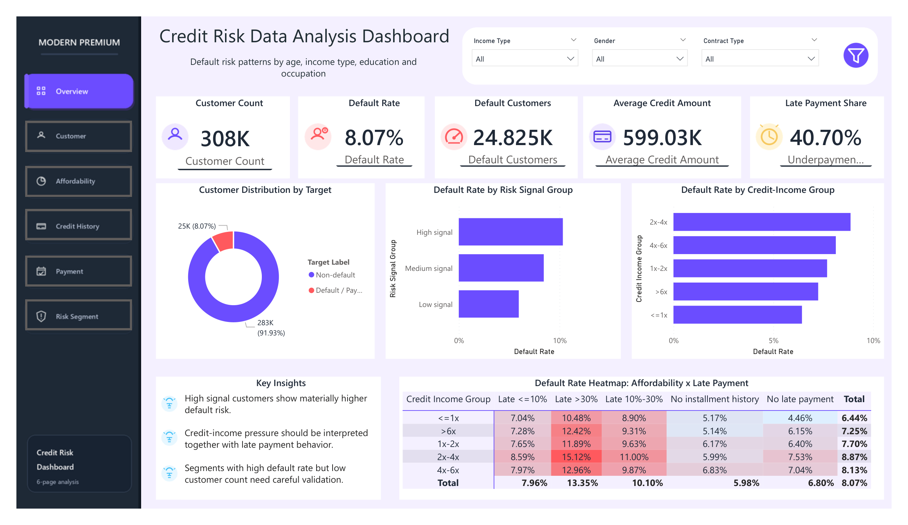

# Credit Risk Analytics & ML Scoring Pipeline


End-to-end credit risk case study combining **SQL**, **Python**, **Power BI**, and machine learning to turn 307,511 labeled loan applications and multi-table credit history into a customer-level decision layer.

## Power BI Dashboard

The six-page dashboard is the main business deliverable. It connects portfolio health, borrower affordability, credit history, payment behavior, and risk segmentation in one review workflow.



| Dashboard page | Decision question |
|---|---|
| Portfolio Overview | How large is the portfolio and where is default concentrated? |
| Customer Profile | Which customer groups require descriptive monitoring? |
| Loan & Affordability | Is requested credit proportionate to income and repayment burden? |
| Credit History | Do external obligations and prior refusals reveal hidden risk? |
| Payment Behavior | Are late payment, underpayment, or revolving utilization signals deteriorating? |
| Risk Segmentation | Which applications should be processed quickly, reviewed manually, or controlled more closely? |

- Editable report: [`dashboard/dashboard.pbix`](dashboard/dashboard.pbix)
- PDF export: [`dashboard/dashboard.pdf`](dashboard/dashboard.pdf)
- Recruiter-facing website: [`site/`](site/)

## Business Results

- Built a **271-feature customer-level master table** from **307,511 labeled applications**.
- Established an **8.07% portfolio default baseline**; accuracy alone is therefore not a reliable evaluation metric.
- Identified credit card utilization above 100% as a severe behavioral signal: **25.50% default**, or **3.16x baseline**.
- Found customers with at least two overdue bureau loans had a **36.80% default rate**. This is a strong signal, but the segment is small and should be interpreted with sample-size caution.
- Selected **LightGBM v3** as the champion single model with **0.7907 ROC-AUC**, **0.3127 PR-AUC**, **0.437 KS**, and **3.66x Lift@10** on final validation.
- Reviewing the top 30% highest LightGBM scores captured **69.1% of validation defaults**, a **2.30x concentration** versus random review.
- Converted scores into review-priority bands under a human-in-the-loop framework. These bands are illustrative analytics outputs, not production approval or rejection rules.

## Repository Structure

```text
credit-risk-analytics-ml-scoring/
|-- dashboard/              Power BI source, PDF export, and six page images
|-- data/
|   |-- raw/                Kaggle source files, not committed
|   `-- processed/          Compressed customer-level outputs
|-- docs/                   Case study, manifests, source-of-truth, SQL/Python mapping
|-- models/                 Model cards and model evidence manifest
|-- notebooks/              Official Step 8 notebook plus archive
|-- outputs/
|   |-- final/              Canonical final evidence tables for review
|   |-- figures/            Analytical figures
|   `-- tables/             Step-level source evidence
|-- reports/                Final presentation and report artifacts
|-- site/                   Recruiter-facing project website
|-- sql/                    Seven SQL ETL and analysis scripts
|-- src/                    Python analytics and modeling pipeline
|-- tests/                  Repository contract tests
|-- run_pipeline.py         Main local runner
|-- requirements.txt        Broad Python dependencies
`-- requirements-lock.txt   Pinned environment used for reproducibility
```

## Technical Workflow

| Layer | Technology | Responsibility |
|---|---|---|
| Data engineering | SQL | Cleaning flags, feature engineering, historical table aggregation, customer-level joins, descriptive segments |
| Analytics | Python | Data validation, descriptive analysis, correlations, diagnostic Logistic Regression, ML benchmarking, SHAP, governance checks |
| Decision support | Power BI | Six-page dashboard that translates analytical evidence into portfolio monitoring and review priorities |
| Portfolio delivery | HTML/CSS/React | Public-facing case study with dashboard-first storytelling and reproducible evidence links |

## Run the Analytics

1. Download the Home Credit Default Risk dataset and place the CSV files in `data/raw/`.
2. Install Python dependencies:

```bash
pip install -r requirements.txt
```

For stricter reproducibility:

```bash
pip install -r requirements-lock.txt
```

3. Run the full local pipeline:

```bash
python run_pipeline.py --stage all
```

Common stage commands:

```bash
python run_pipeline.py --stage master
python run_pipeline.py --stage descriptive
python run_pipeline.py --stage diagnostic
python run_pipeline.py --stage ml
python run_pipeline.py --stage validate
```

Use the included processed train output when raw data is unavailable:

```bash
python run_pipeline.py --stage all --skip-master
```

Step 8 can be rebuilt directly:

```bash
python src/step08_train_champion_v3.py --mode evidence
python src/step08_train_champion_v3.py --mode train
```

`--mode evidence` rebuilds canonical `outputs/final/*.csv` from committed evidence tables. `--mode train` retrains the LightGBM v3-style champion from the processed customer-level table.

## Run the Portfolio Website

```bash
cd site
npm install
npm run dev
```

Then open the local URL shown in the terminal. The website uses the actual dashboard exports in `site/public/dashboard/`.

## Data and Modeling Notes

- Dataset: Home Credit Default Risk from Kaggle.
- Raw Kaggle files are excluded because of size and licensing considerations.
- Processed binaries and Power BI files use Git LFS.
- Reported validation metrics use labeled `application_train.csv` records only.
- Champion single model: **LightGBM v3**.
- Calibrated weighted ensemble: challenger/benchmark; it did not improve ranking enough to justify extra operational complexity.
- Rule-based dashboard segments, ML score bands, and policy decision bands are separate analytical products.
- External score variables are powerful but partially black-box; fairness monitoring and human review remain necessary.
- OOF AUC and final validation AUC are not one-for-one comparable: OOF is fold-based across the labeled population, while validation is a fixed holdout.

## Reproducibility and Evidence

- Canonical final evidence tables are stored in [`outputs/final/`](outputs/final/).
- Headline metrics are mapped to committed source tables in [`docs/METRICS_SOURCE_OF_TRUTH.csv`](docs/METRICS_SOURCE_OF_TRUTH.csv).
- The reproducibility scope and known limits are documented in [`docs/REPRODUCIBILITY_AUDIT.md`](docs/REPRODUCIBILITY_AUDIT.md).
- Champion run environment notes are stored in [`docs/CHAMPION_RUN_ENVIRONMENT.md`](docs/CHAMPION_RUN_ENVIRONMENT.md).
- Model evidence cards are stored in [`models/`](models/), including champion ranking metrics and diagnostic Logistic Regression evidence.
- Lightweight repository contract tests validate that README metrics, model cards, and source-of-truth values match committed evidence:

```bash
python -m unittest discover -s tests -p "test_*.py"
```

See [`docs/PORTFOLIO_CASE_STUDY.md`](docs/PORTFOLIO_CASE_STUDY.md) for the full business interpretation and [`docs/SQL_TO_PYTHON_MAPPING.md`](docs/SQL_TO_PYTHON_MAPPING.md) for implementation traceability.

## License

The project code is released under the MIT License. The Home Credit Default Risk dataset remains subject to its original Kaggle dataset terms and is not redistributed as raw source data in this repository.
